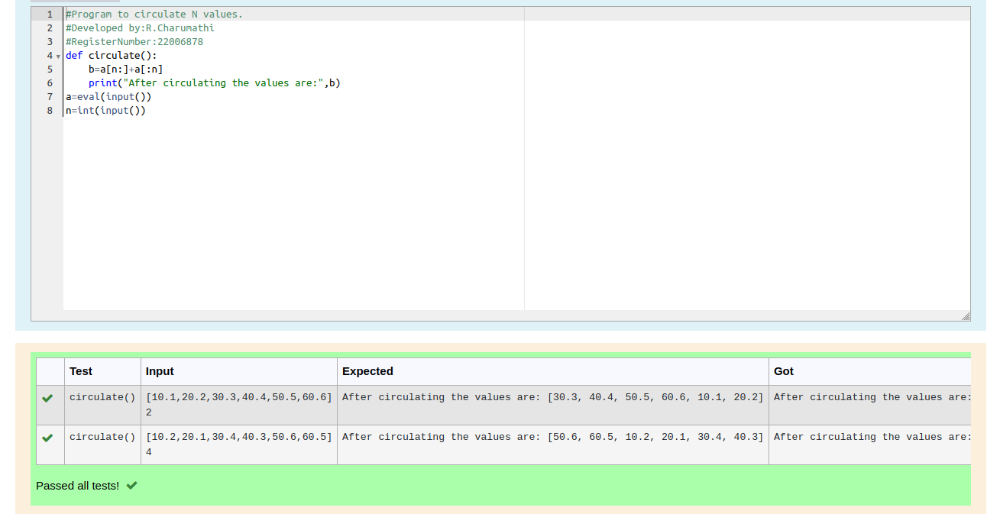

# Circulate-the-values-of-N-variables
## Aim:
To write a python program to circulate the n variables using function concept
## Equipment’s required:
PC
Anaconda - Python 3.7
## Algorithm: 
### Step 1: 
define the function circulate.
### Step 2: 
To calculate, enter the formula.
### Step 3: 
Get the value from the user for the number of rotation.
### Step 4: 
Using the slicing concept rotate the list.\
### Step 5: 
Print the values after circulating.
### Step 6: 
end the program.

## Program:
```
def circulate():
    b=a[n:]+a[:n]
    print("After circulating the values are:",b)
a=eval(input())
n=int(input())
```

## Output:


## Result:
Thus the solutions of circulating the n variables using function concept are successfully solved using python program.